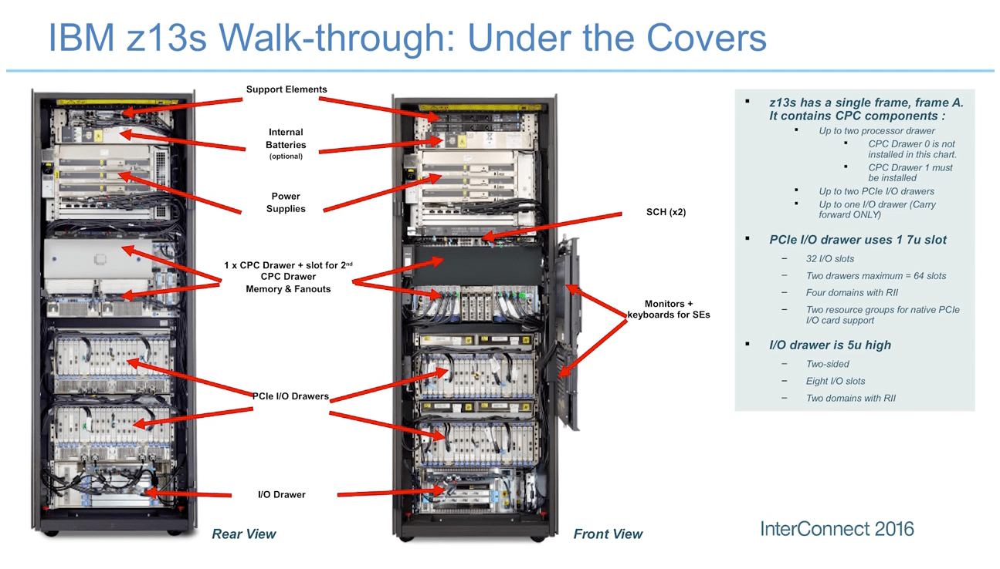

# Mainframe
* Link:https://www.tutorialspoint.com/ims_db/index.htm
<br/>

## ZOS 



## ZOS Command
* ISPF ->edit files
* TSO ->commands

## System Programming
* JES, JCL -> run Cobol programs
* Initiate with submit x. Icl

## COBOL
```
    Level Number, data name, picture caluse, value clause 
    01            TOTAL-STUDENTS            PIC9(5)            VALUE '125'.
    // Value = initialise
```
Levels
1 Record description
88 condition entry

## IMS
### IMS Connect
* TCPIP
### DL/I – Data Language Interface - that grant access to the data stored in the database
### Trasaction Manager (MQ)
* Manage Access

### Database Manager (Hierachical)
* SSA stands for Segment Search Arguments = query
```
CALL 'CBLTDLI' USING DLI-GU
                     PCB-NAME
                     IO-AREA
                     LIBRARY-SSA
                     BOOKS-SSA
                     ENGINEERING-SSA
                     IT-SSA
```
* DBD describes the complete physi
* A database has a single physical structure defined by a DBD but the application programs that process it can have different views of the database. These views are called application data structure and are defined in the PSB.cal structure of the database once all the segments have been defined.
* Program Communication Block (PCB) that describes the database Type, Name, Key-Length, and Processing Option.
* PSB->PCB->DBD
